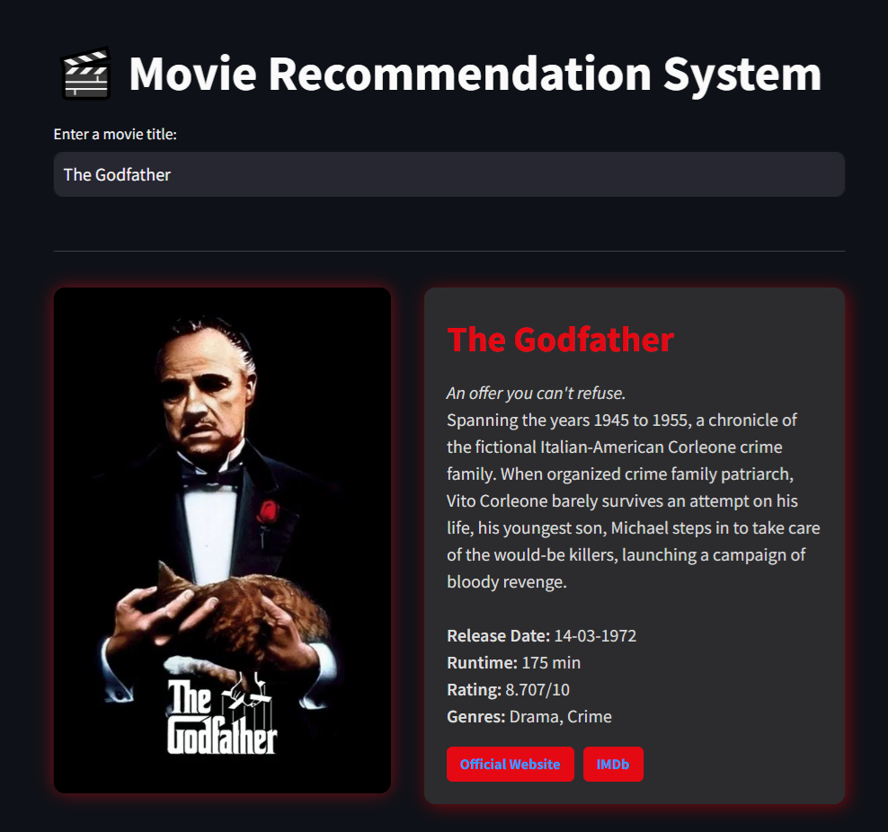
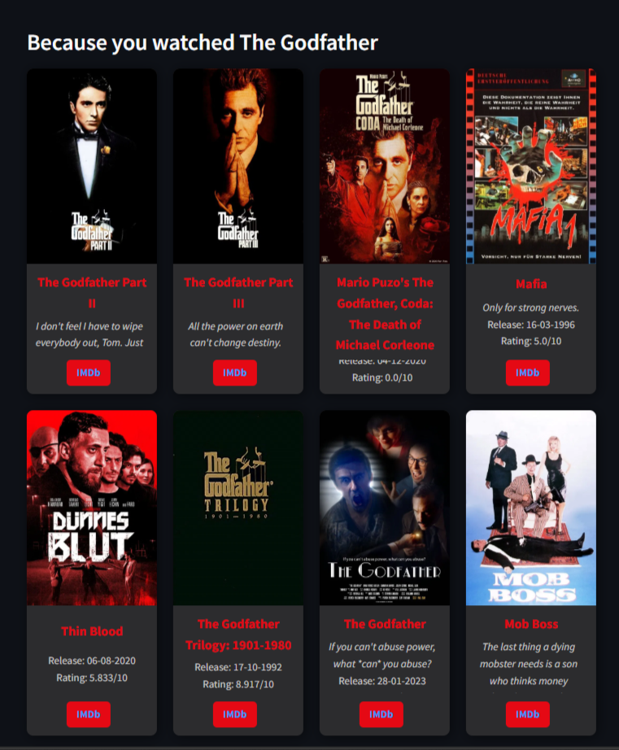
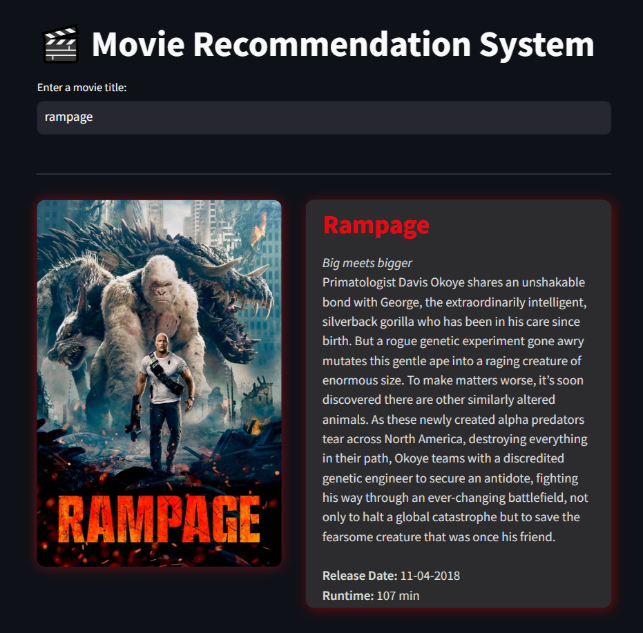
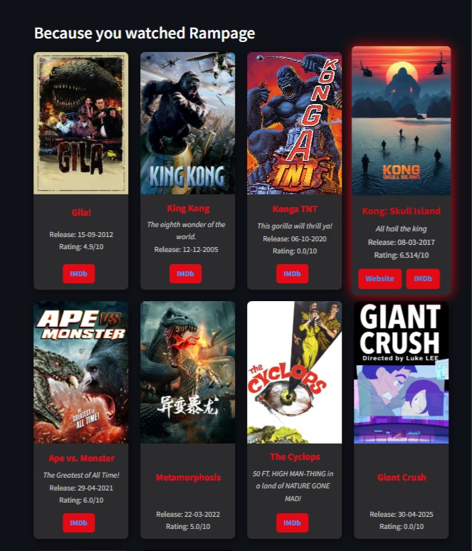

# 🎬 Movies Recommendation System

A simple yet effective content-based movie recommendation system built using **Python**, **Pandas**, **Scikit-learn**, and **Streamlit**.

---

##  Overview

This system recommends movies similar to the one entered by the user, based on the movie’s:

- Title
- Overview
- Keywords
- Genres

These features are combined and vectorized using **TF-IDF**, then similarity is calculated using **Cosine Similarity** to return the most relevant recommendations.

---

##  How it Works

1. **Data Preparation**
   - Created a new column `combined_text` by merging:
     - `title`
     - `overview`
     - `keywords`
     - `genres`

2. **TF-IDF Vectorization**
   - Used `TfidfVectorizer` from `sklearn` to convert text to numeric vectors.
   - English stop words were removed for better relevance.

3. **Similarity Calculation**
   - Calculated cosine similarity between all movie vectors.
   - Returned the top 10 most similar movies to the one entered.

4. **Streamlit Interface**
   - Simple web interface where the user:
     - Types a movie name.
     - Gets the top 10 recommended movies.
---
## 📂 Dataset

We used the following dataset from Kaggle to build and test our recommendation system:

🔗 [TMDB Movies Dataset 2023 – 930K+ Movies](https://www.kaggle.com/datasets/asaniczka/tmdb-movies-dataset-2023-930k-movies)

---

##  Movie Recommendation Demo Results

### 🎩 The Godfather

  
  

### 🦍 Rampage

  
  

